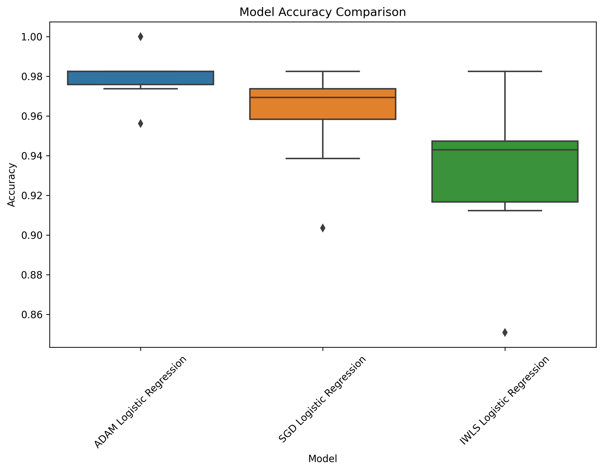

# AdvancedMachineLearningProject-MINI

## Project 1 - Optimization algorithms

### 1.1 - Files
```
classes.py - ADAM, IWLS and SGD implementation
main.py - run simple experiments and comparing models
model_accuracy_comparison.png - models comparation
```

### 1.2 - Model comparations

